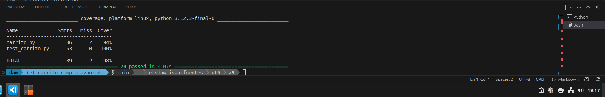

## UT6-A5 Testing avanzado de un carrito de compra
### Contexto

Una tienda online está ampliando su sistema de gestión de pedidos. El módulo de carrito de compra ha evolucionado y ahora incluye nuevas funcionalidades como cupones de descuento e impuestos.

El equipo de desarrollo ha implementado el código, pero el equipo de QA (vosotros) debe diseñar una batería completa de tests que verifique su correcto funcionamiento.


### Objetivo

Diseñar e implementar una batería de tests utilizando **pytest** que permita:

+ Validar el comportamiento completo del sistema
+ Detectar posibles errores en la implementación
+ Analizar la cobertura de código mediante pytest-cov

### Comportamiento del sistema

El módulo dispone de las siguientes funciones:

1. Calcular subtotal

   + Función: ``calcular_subtotal(carrito)``
   + El carrito es una lista de productos
   + Cada producto tiene:
     + ``nombre : string``
     + ``precio : float``
     + ``cantidad : int``

Ejemplo:

```python
[
 {"nombre":"teclado","precio":30,"cantidad":2},
 {"nombre":"raton","precio":10,"cantidad":1}
]
```
+ El subtotal se calcula como: ``precio * cantidad``
+ Consideraciones:
  + El carrito puede estar vacío
  + No se permiten precios negativos
  + No se permiten cantidades negativas

2. Aplicar descuento

+ Función: ``aplicar_descuento(subtotal, descuento)``

+ El descuento es un porcentaje (0–100)

Ejemplo:
```
subtotal = 100
descuento = 10
resultado = 90
```

+ Consideraciones:
  + 0% → no modifica el subtotal
  + 100% → total 0
  + Valores fuera de rango → error

3. Aplicar cupón

+ Función: ``aplicar_cupon(subtotal, cupon)``

Cupones disponibles:

+ WELCOME10 → 10% de descuento
+ FREESHIP → envío gratis
+ Otros cupones → inválidos

4. Calcular gastos de envío

+ Función: ``calcular_envio(subtotal)``

  + Si subtotal ≥ 100 → envío gratis
  + Si subtotal < 100 → 5€

5. Calcular impuestos

+ Función: ``calcular_impuestos(subtotal)``

  + Se aplica un 7% de IGIC

6. Calcular total del pedido

+ Función: ``calcular_total(carrito, descuento, cupon)``

El flujo completo es: ``SUBTOTAL → DESCUENTO → CUPÓN → ENVÍO → IMPUESTOS → TOTAL``

### Trabajo a realizar

Debéis diseñar una batería de tests en un archivo ``test_carrito.py`` cuempliendo los requisitos:

Requisitos mínimos:

+ Subtotal
  + carrito con varios productos
  + carrito con un solo producto
  + carrito vacío
  + valores inválidos (precio o cantidad negativa)
  
+ Descuentos
  + descuento 0%
  + descuento válido
  + descuento 100%
  + descuento inválido (>100 o negativo)
  
+ Cupones
  + cupón válido (WELCOME10)
  + cupón de envío gratis (FREESHIP)
  + cupón inválido
  
+ Envío
  + subtotal menor que 100
  + subtotal mayor o igual que 100
   
+ Impuestos
  + cálculo correcto del 7%
  + redondeo a 2 decimales

+ Total del pedido
  + pedido sin descuento
  + pedido con descuento
  + pedido con cupón
  + pedido con envío gratis
  + combinación de todos los elementos

Requisitos obligatorios:

+ Mínimo 15 tests
+ Uso de: ``pytest`` y  ``pytest-cov``

+ Incluir:
  + **Tests parametrizado**s (``@pytest.mark.parametrize``). Los tests parametrizados permiten ejecutar el mismo test varias veces con distintos valores de entrada, evitando duplicar código. Son especialmente útiles cuando quieres comprobar un mismo comportamiento con diferentes casos. Por ejemplo :

```python
import pytest

@pytest.mark.parametrize("subtotal,descuento,resultado_esperado", [
    (100, 0, 100),
    (100, 10, 90),
    (100, 100, 0),
])
def test_aplicar_descuento(subtotal, descuento, resultado_esperado):
    assert aplicar_descuento(subtotal, descuento) == resultado_esperado
```
**"subtotal,descuento,resultado_esperado"** → nombres de los parámetros
La lista contiene los distintos casos de prueba. El test se ejecuta automáticamente una vez por cada tupla. En este ejemplo se ejecutan 3 tests distintos con una sola función.

  + **Tests de excepciones**. Sirven para comprobar que el programa responde correctamente ante errores o valores inválidos. En lugar de verificar un resultado, verifican que se produce una excepción.

```python
import pytest

def test_descuento_invalido():
    with pytest.raises(ValueError):
        aplicar_descuento(100, 150)
```
+ pytest.raises(ValueError) indica que esperamos una excepción
+ El test solo pasa si la excepción ocurre
+ Si no ocurre → el test falla

**¿Cuándo usar cada uno?**

Usa tests parametrizados cuando:
+ Hay muchos casos similares
+ Cambian solo los datos de entrada
+ Quieres evitar repetir código

Ejemplo:

+ descuentos
+ cálculos matemáticos
+ diferentes combinaciones de entrada

Usa tests de excepciones cuando:
+ Hay valores inválidos
+ El sistema debe rechazar datos incorrectos

Ejemplo:

+ descuento negativo
+ precio negativo
+ cupón inválido

En esta práctica deberías usar:

+ Tests parametrizados → para probar múltiples combinaciones (descuentos, subtotales…)
+ Tests de excepciones → para validar errores del sistema

### Cobertura

Debes alcanzar al menos un 85% de cobertura de código. Incluye a continuación una captura de pantalla de la cobertura de código:




### Análisis de errores

A continuación responde a las siguientes preguntas:

1. Tests que han fallado
+ Indica cuáles fallan inicialmente
+ Explica por qué deberían pasar

2. Identificación de errores
+ Función donde se encuentra el error

  Enontramos errores en el carrito, ya que se tenia que añadir una parte de codigo que al dectectar que el la clave de cantidad y precio fuera negativa saltara un error
+ Línea incorrecta

  linea 4
+ Explicación del problema

  No saltaba error tras valores negativos
3. Corrección propuesta
+ Explicación de la solución

  Usamos una excepcion llamada ValueError con un raise que lo que hace basicamente es dispara esta excepcion y hacer que el codigo no explote
+ Código corregido

```python
  def calcular_subtotal(carrito):
    subtotal = 0
    for producto in carrito:
        if not isinstance(producto['nombre'], str) or not isinstance(producto['precio'], (int, float)):
            raise ValueError('Valores no aceptados en el carrito')
        if producto['precio'] < 0 or producto['cantidad'] < 0:
            raise ValueError('No pueden ser negativos')
        precio = producto["precio"]
        cantidad = producto["cantidad"]
        subtotal += precio * cantidad
    return subtotal
```

4. Resultado final
   + Número de tests implementados

    20
   + Cobertura obtenida

    98%
   + ¿Todos los tests pasan?

   Hasta el momento si

   Trabajo hecho por:

   Samuel Lugo
   
   Isaac Fuentes

